# 📚 Website Perpustakaan Digital

Project ini adalah website peminjaman buku sederhana yang dibuat untuk latihan pengembangan web.

## 🔧 Fitur
- Menampilkan daftar buku
- Sistem peminjaman buku
- Manajemen data buku

## 🛠️ Teknologi
- HTML
- PHP
- CSS
- MySQL
- XAMPP

## ▶️ Cara Menjalankan
1. Install XAMPP
2. Aktifkan Apache & MySQL
3. Import file database.sql ke phpMyAdmin
4. Jalankan di browser:
   http://localhost/perpustakaan-digital

## 📌 Catatan
Project ini berjalan secara lokal (localhost) dan belum di-deploy ke server online.

## 🖼️ Tampilan

### Halaman Admin
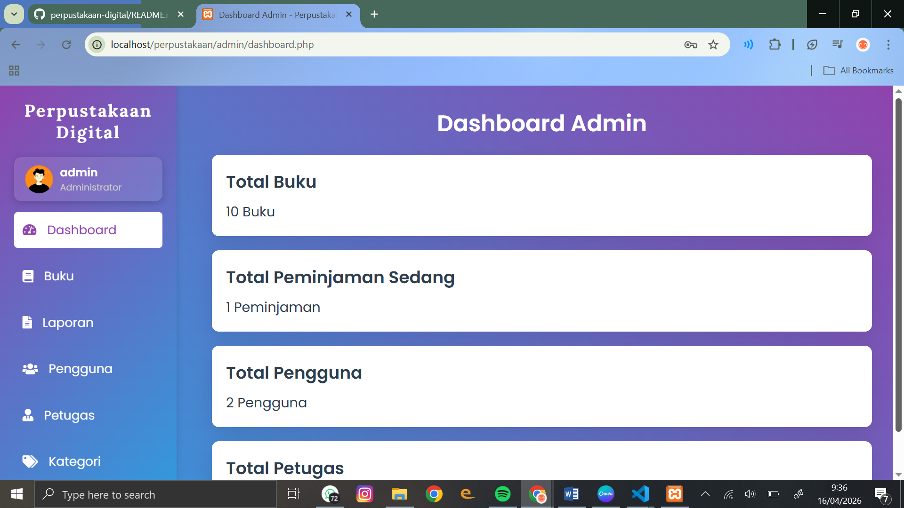
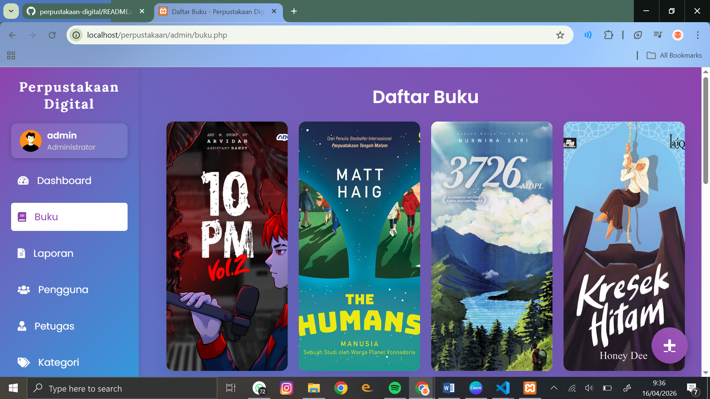
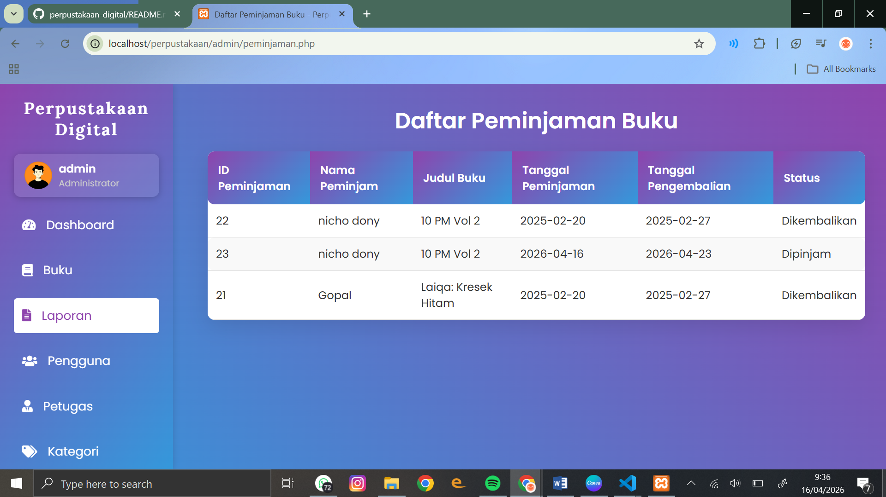
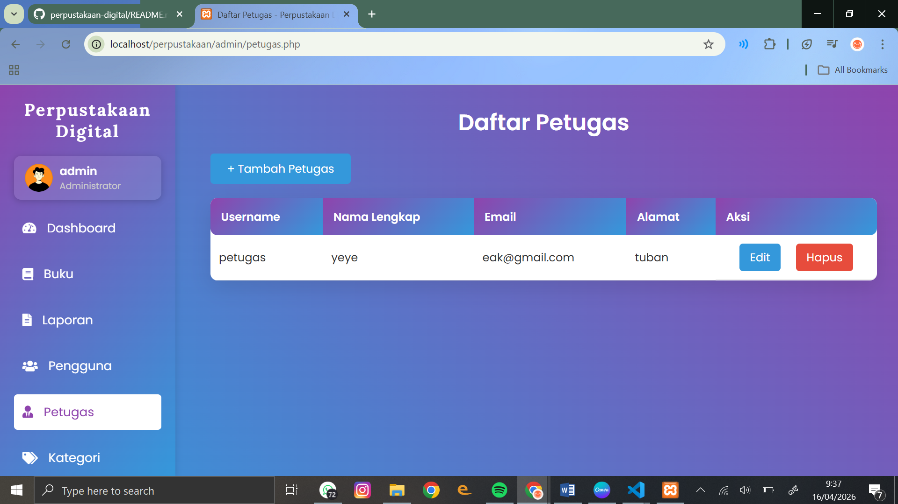
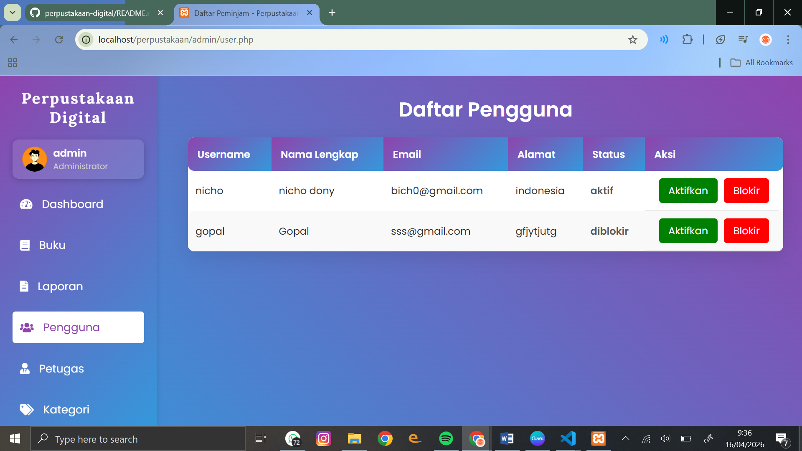
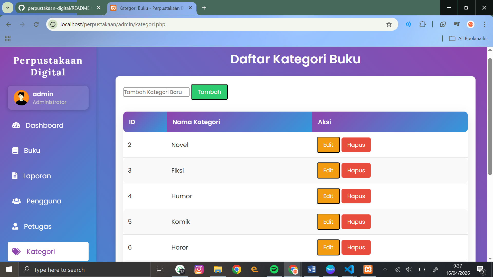

### Halaman Petugas
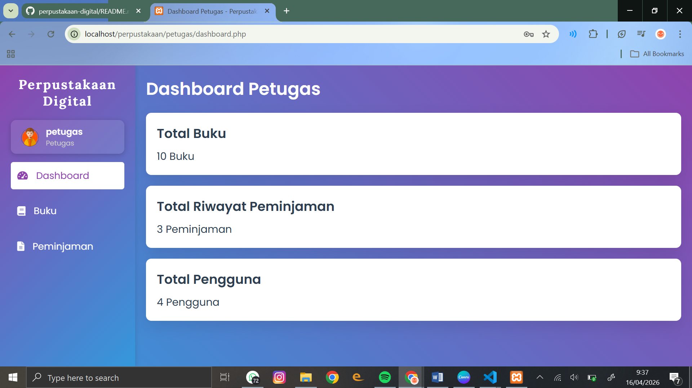
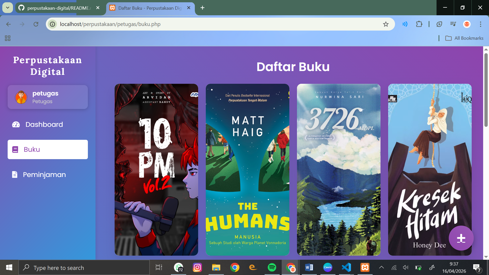
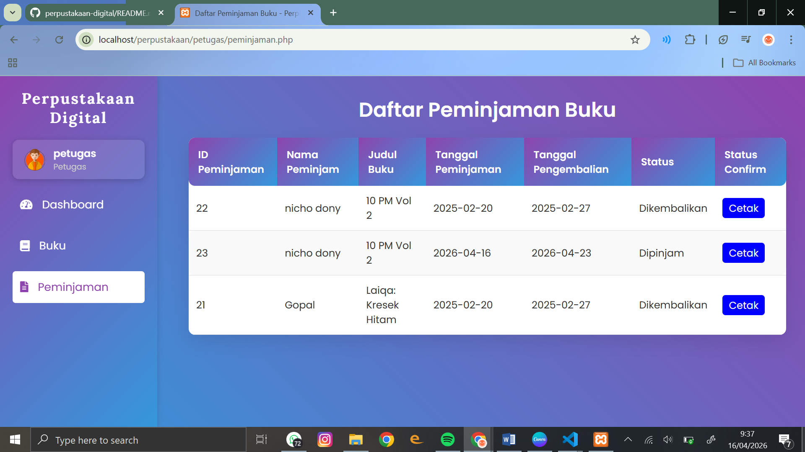
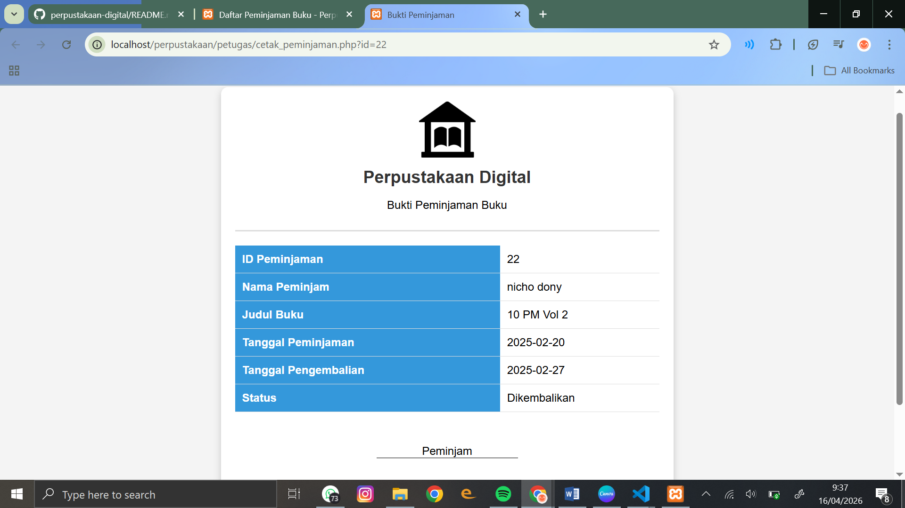

### Halaman User
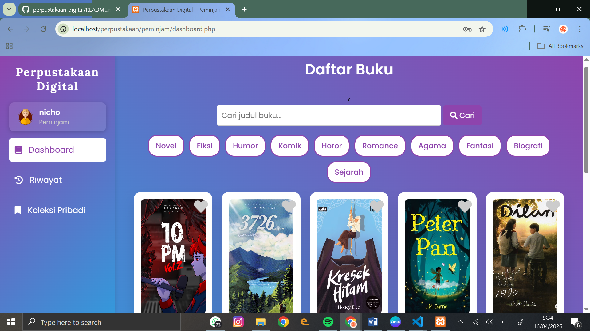
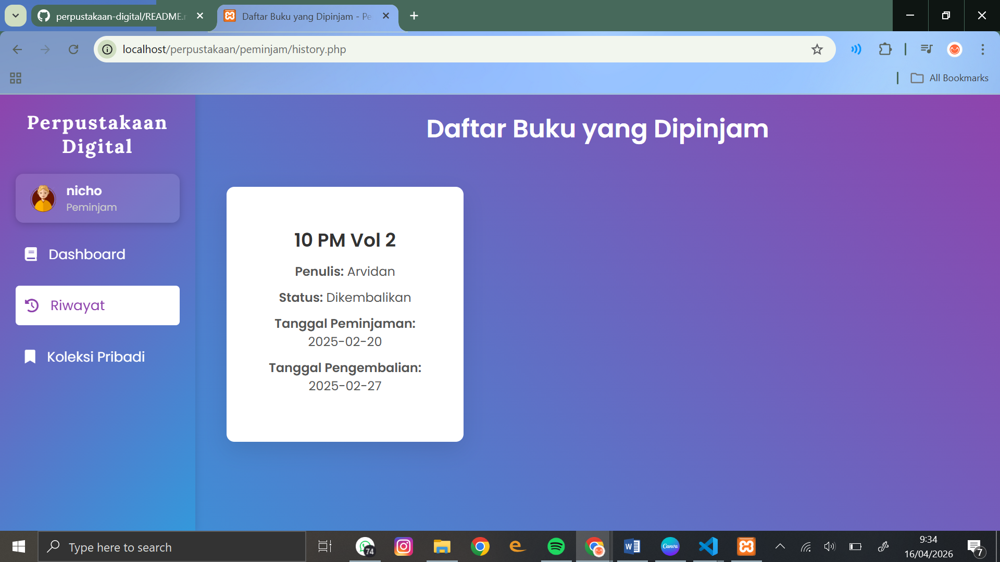
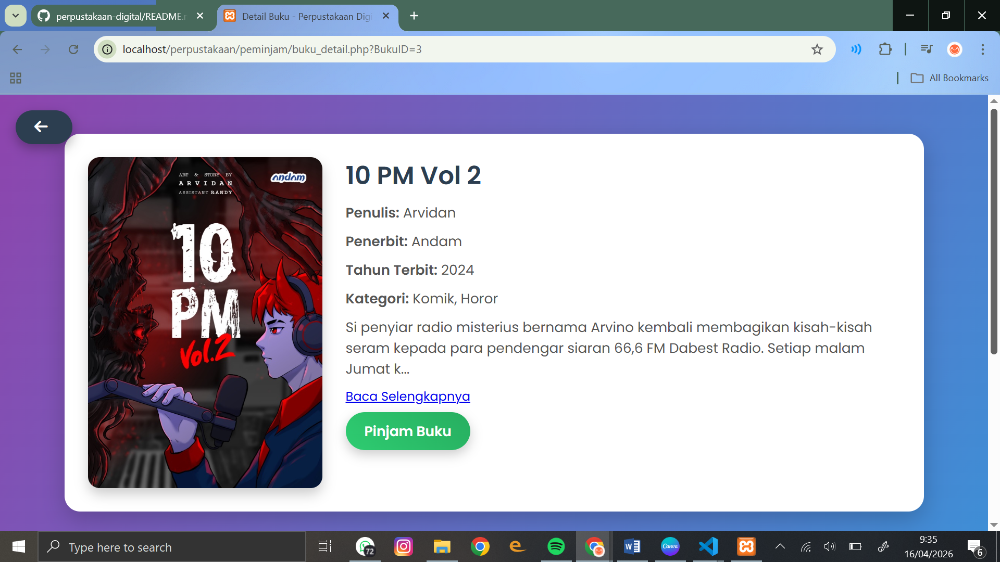
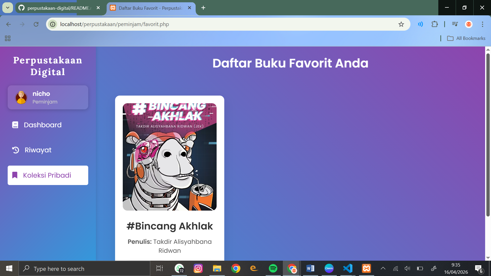
